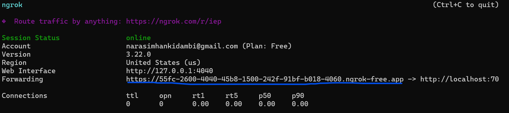

<!-- omit in toc -->
# GitLab WebHook <-> Custom Question Answer Automation

An application that listens to a changes in wiki pages in Gitlab, and accordingly updates the knowledge base in Custom Question Answering Project

<!-- omit in toc -->
## Table of Contents
- [Pre-requisites](#pre-requisites)
- [Architecture](#architecture)
- [Folder Structure](#folder-structure)
- [Application Settings](#application-settings)
- [Setup](#setup)
  - [Run Locally](#run-locally)
    - [Pre-requisites](#pre-requisites-1)
    - [Steps for running Azure Functions](#steps-for-running-azure-functions)
    - [Steps for Gitlab webhook](#steps-for-gitlab-webhook)
  - [Deploy to Azure](#deploy-to-azure)
  - [Testing locally](#testing-locally)
  - [Testing from Azure](#testing-from-azure)


## Pre-requisites
- [Azure Language resource with Custom Question Answering enabled](https://learn.microsoft.com/en-us/azure/ai-services/language-service/question-answering/how-to/create-test-deploy#create-your-first-custom-question-answering-project)
- Azure Functions 
- Azure Tools for VS Code
- Gitlab account with access to creating webhooks, [API keys](https://docs.gitlab.com/user/profile/personal_access_tokens/#create-a-personal-access-token)
- Gitlab project and wikis already created and have access to them
- Access to create resources in Azure

## Architecture


## Folder Structure
| **Folder**                           | **Description**                             |
| ------------------------------------ | ------------------------------------------- |
| 📁GitLab_WebHook_CustomQnA          | Root folder of the project                  |
| └── 📁models                        | Contains model-related scripts              |
| └────── webhook_model.py             | Contains the webhook event data                  |
| └── 📁services                      | Contains service-related scripts            |
| └────── AzureBlobStorage.py          | Azure Blob Storage service that stores the HTML       |
| └────── AzureQueueService.py         | Azure Queue service to store webhook events              |
| └────── CustomQnAService.py          | Custom QnA Service tp add/update/delete knowledge sources |
| └────── GitlabServices.py            | GitLab service to get wiki page content      |
| └── function_app.py                  | Main function application             |
| └── Gitlab_ReferenceArchitecture.png | Reference architecture image for GitLab     |
| └── host.json                        | Configuration for azure function hosting                   |
| └── image.png                        | Sample or illustrative image file           |
| └── LICENSE                          | License details for the project             |
| └── local.settings copy.json         | Local settings file (copy)                  |
| └── README.md                        | Documentation and project overview          |
| └── requirements.txt                 | Dependencies for the project                |


## Application Settings
Following application settings are needed to be set for the Azure functions


| **Key**                     | **Description**               | **Default Value**                                                                |
| --------------------------- | ----------------------------- | -------------------------------------------------------------------------------- |
| AzureWebJobsStorage         | Storage account connection    |                                                                                  |
| FUNCTIONS_WORKER_RUNTIME    | Language worker runtime       | python                                                                           |
| WEBHOOK_STORAGE             | Webhook storage details       |                                                                                  |
| QUEUE_NAME                  | Queue name for processing     |                                                                                  |
| WIKI_HTML_CONTAINER_NAME    | HTML container name for wikis |                                                                                  |
| LANGUAGE_SERVICE_ENDPOINT   | Endpoint for language service |                                                                                  |
| LANGUAGE_SERVICE_API_KEY    | API key for language service  |                                                                                  |
| QNA_PROJECT_NAME            | QnA project name              |                                                                                  |
| QNA_DEPLOYMENT_NAME         | QnA deployment name           |                                                                                  |
| GITLAB_API_URL              | GitLab API URL for wikis      | https://gitlab.com/api/v4/projects/{projectId}/wikis/{wikislug}?render_html=true |
| GITLAB_API_TOKEN            | API token for GitLab          |                                                                                  |
| GITLAB_WEBHOOK_SECRET_TOKEN | Secret token for webhook      | secret_token                                                                     |


## Setup

### Run Locally

#### Pre-requisites
1. Update the values for the keys in the [app settings](#application-settings)
2. Install [ngrok](https://dashboard.ngrok.com/get-started/setup/windows) and add it to your path

#### Steps for running Azure Functions
1. Clone the code to your local machine and open the folder in VS code
2. Setup Python environment to a `.venv` file
3. Click on the `Run and Debug` icon on the left sidebar and click on the "play" icon at the top. This will launch the local debugger and show the output in the terminal. 
4. In the terminal, once the function is running, you will get a url
    ```
    https:://localhost:<port number>/api/parsefile
    ```
5. Open Command prompt and run ngrok as below with port number from step 4
   ```
   ngrok http number --host-header="localhost:<port number>"
   ```

6. This will yield a url that will act as a tunnel to your azure function as shown below
   

7. Copy the url. We will use it to configure the Webhook in Gitlab side.

#### Steps for Gitlab webhook

**Note**
- Please make sure the webhook is created at the group level and NOT at individual project level.

1. Please follow these [instructions](https://docs.gitlab.com/user/project/integrations/webhooks/#create-a-webhook) to configure a webhook at group level. 
   1. For the `URL` enter the following value
      1. If running locally
        ```
        <ngrok URL>/api/ParseFile
        ```
   2. For the `Secret Token` section, enter a value and also update the key `GITLAB_WEBHOOK_SECRET_TOKEN` in the [app settings](#application-settings) of the azure functions
   3. For the `Trigger` section, select `Wiki page events`
   4. For the `Custom webhook template` section, enter the below json
    ```json
        {
            "objectKind": "{{object_kind}}",
            "projectName": "{{project.name}}",
            "projectId": "{{project.id}}",
            "wikiSlug":"{{object_attributes.slug}}",
            "wikiAction":"{{object_attributes.action}}"
        }
    ```
   **note**: Any changes maded to this model, should also be made in the code wherever webhook_Model is being used.

### Deploy to Azure
1. Follow these [instructions](https://learn.microsoft.com/en-us/azure/azure-functions/functions-develop-vs-code?tabs=node-v4%2Cpython-v2%2Cisolated-process%2Cquick-create&pivots=programming-language-python) to have Azure functions deployed to Azure
2. Make sure you update the values in the [app settings](#application-settings)
3. Copy the azure function Url and update the Webhook url in Gitlab like this
    ```
        <Azure Function url>/api/ParseFile
    ```

### Testing locally
After setting up [azure function locally](#steps-for-running-azure-functions) and [gitlab webhooks](#steps-for-gitlab-webhook), follow these steps

1. Login to GitLab and go to your project.
2. Create / update a wiki page
3. You should see the Azure functions kick off and upsert the knowledge base in Custom Question Answering
4. Login to Custom Question Answering, select your project and you should see your wiki page added/updated there.

### Testing from Azure
1. Ensure the app settings are configured correctly
2. Ensure the webhook url is pointing to the azure function url in Azure
3. Login to GitLab and go to your project.
4. Create / update a wiki page
5. Login to Custom Question Answering, select your project and you should see your wiki page added/updated there.